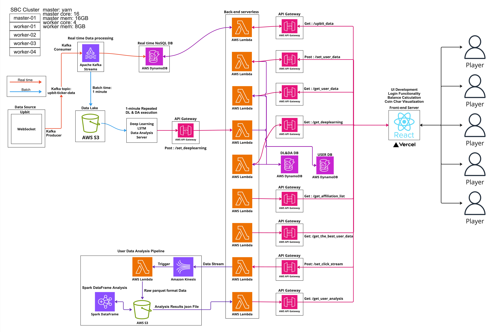

# 💰 **Coin Prediction King - Data Engineering Repository**

Welcome to the **Coin Prediction King** (‘코인예측왕’) Data Engineering repository! This repository manages all data-related pipelines, processing, and analytics for the Coin Mock Investment game, ensuring real-time data flow and efficient storage.

---

## 🌐 **Project Overview**

**Coin Prediction King** is a real-time cryptocurrency mock investment game where players predict market trends and compete based on their virtual portfolio performance.

### **Key Features:**
- ⚡ Real-time cryptocurrency data ingestion from **Upbit WebSocket API**
- 🚀 High-speed data processing using **Kafka Streams**
- 🌌 Efficient data storage with **AWS Firehose**, **S3**, and **Spark** analytics
- 💡 Advanced analytics pipeline with **PySpark** for performance insights

---

## 🚀 **Architecture**



###  **Upbit data pipe line**
```
Upbit WebSocket → On-premises Kafka Streams → DynamoDB →
→ AWS Lambda → API Gateway (Frontend Data Requests)
```
###  **Click Stream data Analytics pipe line**
```
Frontend Post Requests Click Stream Data (json) → API Gateway → AWS Lambda → Kinesis Data Streams (parquet) → AWS S3
→ on-premises Spark cluster → AWS S3 (json) → AWS Lambda → API Gateway → Frontend User Data Analysis (json)
```

### **Core Technologies:**
- **Data Ingestion:** Kafka Streams (on-premises)
- **Storage:** AWS S3 (Parquet format), DynamoDB (legacy), Redis (planned migration)
- **Processing:** AWS Lambda + API Gateway
- **Analytics:** Apache Spark (PySpark)

---

## 📁 **Repository Structure**

```bash
├── dataIngestion/               # Kafka Streaming scripts
├── dataLake/                    # S3 storage management
├── dataProcessing/              # Spark-based data analytics scripts
├── logs/                        # Log files (ignored in Git)
├── .gitignore                   # Files excluded from Git
├── assets/
│   └── architecture.jpg
└── README.md
```

---

## 🔧 **How to Contribute**

1. Fork the repository
2. Create your feature branch (`git checkout -b feature/new-feature`)
3. Commit your changes (`git commit -m 'Add new feature'`)
4. Push to the branch (`git push origin feature/new-feature`)
5. Open a Pull Request
